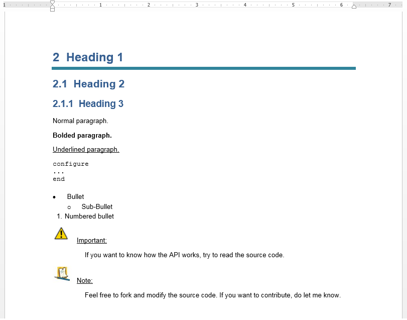

Python Docx Templates
========================

This module is used to **automate the generation** of documents according to a predefined **docx (Word) template**.

Store the template into the "template" folder, add the appropriate tags, and use the library according to the following example:

Source code: ::

  import bdblib
  from task_docx_template_AS_lib import Report
  # For Python 2.7 use  -  from task_docx_template_AS_lib_py27 import Report
  
  report = Report(title='Title', subtitle="Sub title", version="0.1")
  
  # Create headers of different levels
  report.add_heading("Heading 1", level=1)
  report.add_heading("Heading 2", level=2)
  report.add_heading("Heading 3", level=3)
  
  # Normal, bolded and underlined paragraphs
  report.add_paragraph("Normal paragraph.")
  report.add_paragraph("Bolded paragraph.", bold=True)
  report.add_paragraph("Underlined paragraph.", underline=True)
  
  # Paragraph deletion
  report.add_paragraph("Another paragraph.")
  report.delete_paragraph("Another paragraph.")
  # Add commands or command blocks to your report.
  report.add_command("""configure...end""")
  
  # Bullets
  report.add_bullet("Bullet")
  report.add_bullet("Sub-Bullet", level=2)
  report.add_bullet("Numbered bullet", numbering=True)
  
  # Custom sections such as warnings or notes
  report.add_warning("If you want to know how the API works, try to read the source code.")
  report.add_note("Feel free to fork and modify the source code. If you want to contribute, do let me know.")
  
  # Table
  report.add_table([["Header1"  ,"Header1"  ,"Header1"  ],
                    ["Element11","Element12","Element13"],
                    ["Element21","Element22","Element23"])
  
  # Lastly, export the document
  report.save("document.docx")

